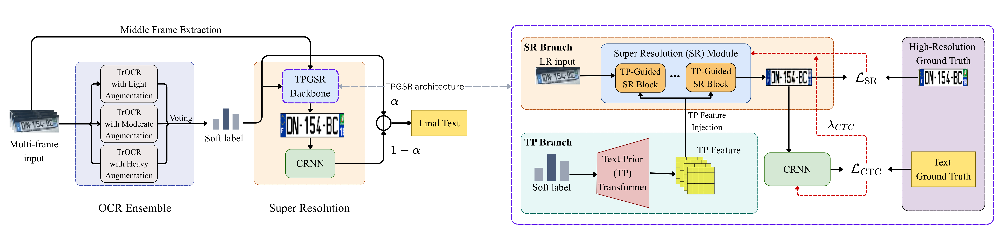

# License Plate Super-Resolution (ICIP-XLPSR)

> 📢 **The 2-page extended abstract describing this work has been accepted at a workshop of the IEEE ICIP 2026 conference, as part of the ICIP-XLPSR challenge.**

Multi-frame license plate super-resolution and recognition. The pipeline fuses a
TrOCR ensemble, a text-prior-guided super-resolution network (TPGSR), and a CRNN
recognizer to reconstruct a high-resolution plate image and predict the plate text
from a sequence of low-resolution frames.

## Pipeline



1. **OCR ensemble (OCR1).** Three TrOCR models (light / moderate / heavy
   augmentation) read every frame in the sequence. Their beam-search hypotheses are
   combined by per-position **soft voting** into a *soft label* — a probability
   distribution per character, with uncertain positions left blank (`_`).
2. **Super-resolution (TPGSR).** The soft label is injected as a *text prior* into
   the TPGSR backbone, which upscales the low-resolution plate (2× pixel-shuffle).
3. **Recognition (OCR2).** A CRNN reads the super-resolved image and produces
   per-character probabilities via CTC decoding.
4. **Fusion.** The final text is a weighted combination of OCR1 and OCR2
   (`α·OCR1 + (1−α)·OCR2`), with low-confidence positions filled only above a
   threshold.

Supported plate formats (configurable in [`src/config.yaml`](src/config.yaml)):

| Type | Pattern    | Length | Example regex                 |
|------|------------|--------|-------------------------------|
| 1    | `DDDLLLDD` | 8      | `^[0-9]{3}[A-Z]{3}[0-9]{2}$`  |
| 2    | `DDDDLLDD` | 8      | `^[0-9]{4}[A-Z]{2}[0-9]{2}$`  |
| 3    | `LLDDDLL`  | 7      | `^[A-Z]{2}[0-9]{3}[A-Z]{2}$`  |

(`D` = digit, `L` = letter.)

## Repository layout

```
.
├── figure/Full_pipeline.png   # pipeline diagram
├── models/                    # checkpoints go here (not tracked in git)
├── src/
│   ├── config.yaml            # static settings (paths, plate rules, hyperparams)
│   ├── config.py              # loads config.yaml and derives runtime objects
│   ├── inference.py           # entry point
│   ├── pipeline.py            # InferencePipeline orchestration
│   ├── model/                 # RRDB/TPGSR and CRNN architectures
│   └── utils/                 # voting, OCR1+OCR2 fusion, image helpers
├── test_input/                # example input sequence
└── test_output/               # example output
```

## Installation

```bash
git clone https://github.com/lamphuc1603/License-Plate-Super-Resolution.git
cd License-Plate-Super-Resolution
pip install -r requirements.txt
```

Install the `torch` / `torchvision` build matching your CUDA version — see the
[PyTorch install guide](https://pytorch.org/get-started/locally/). The pipeline runs
on GPU if available and falls back to CPU otherwise.

## Checkpoints

Checkpoints are **not** included in this repository. Download them and place them in
`models/` so the layout matches the paths in [`src/config.yaml`](src/config.yaml):

```
models/
├── tpgsr_v5_best.pt
├── crnn_v5_best.pt
├── trocr_processor/          # TrOCR processor
├── trocr_light/              # checkpoint-* subfolders (latest is used)
├── trocr_medium/
└── trocr_heavy/
```

> Download link: _will be updated soon._

## Usage

Place each sequence as a folder of frames under the input directory:

```
test_input/
└── sample_001/
    ├── img_01.png
    ├── img_02.png
    └── ...
```

Optionally provide an `all_sequences.csv` in the input directory listing the
sequences to process (column `sequence_id` / `seq_id` / `id`, or first column);
otherwise all sub-folders are processed.

Run inference:

```bash
python src/inference.py
```

Results are written per sequence to the output directory:

```
test_output/
└── sample_001/
    ├── sr.png        # super-resolved plate image
    └── text.txt      # predicted plate text
```

## Configuration

All static settings live in [`src/config.yaml`](src/config.yaml): input/output/model
paths, plate formats, image dimensions, and inference hyperparameters (number of
beams, voting/fusion thresholds, OCR1 weight). Relative paths are resolved against the
project root; absolute paths are used as-is.